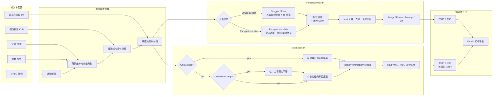

# Depression Suite FST/TST 逆向分析报告

> 2026-09-10 更新：已用授权视频、人工计时和 CSI 导出完成实测诊断验证；增量改进结论见 [实测数据验证与增量改进建议](2026-09-10_实测验证-DepressionSuite-report.md)。

> 分析日期：2026-09-09  
> 目标：ForcedSwimScan HR V2.0、TailSuspScan HR V2.0  
> 分析方式：授权范围内的离线静态分析  
> 报告结构：普通二进制逆向，`flavor = null`  
> 工具链：radare2 6.2.2 +1、Ghidra 12.1.3、CPython、pypdf

## 1. 执行摘要

两个程序均为同一 Depression Suite 基础代码派生的 32 位原生 Windows/MFC 图像分析应用，而不是 .NET 程序；它们拥有完全相同的 742 项导入集合、相同的自定义线性决策树引擎和逐字节相同的分类器文件。共同前端负责 MPEG 帧、背景差分、槽位标定、前景分割和身体部位分类，真正的分叉发生在行为运动度量层。ForcedSwimScan（FST）按术语模式输出 Struggle/Float 或 Escape/Immobile，并结合水面、攀爬和身体区域特征；TailSuspScan（TST）默认先估计并移除被动刚性平移，再用点云形变区分 Mobility/Immobility。SET、CLB、DT、FSR3 和 TSR1/LSR 的主要布局已恢复，并提供只读检查器；所有随包 SET/CLB/DT 样例均通过边界验证。安装包没有真实 FSR/LSR 结果样例，本次也未启动目标 EXE，因此结果回放和真实视频数值一致性仍属于动态验证边界。

## 2. 范围、授权与目标

完整范围见 [scope.md](../scope.md)：`auth.status=granted`、`ready_for_act=true`、`network_profile.mode=offline`。分析对象仅限本机指定目录中的两个主程序、随包文档与辅助数据；没有网络探测、目标程序执行、动态插桩或外部数据发送。该边界记录为 [E-scope-boundary](../evidence/E-scope-boundary.md)。

| 属性 | ForcedSwimScan.exe | TailSuspScan.exe |
|---|---|---|
| 文件类型 | PE32 / x86 / Windows GUI / native | PE32 / x86 / Windows GUI / native |
| 大小 | 3,923,968 bytes | 3,897,344 bytes |
| SHA-256 | `341A5BA8D9BEC53455234A7872EF2BB57CFF837C04EFAA2CE8D6F5533E2BD054` | `AA85E490ABD8C605AC0AC52F874A9C1A7F679B094E6FFB8A8DA346690ECBC95C` |
| MD5 | `1D7C2ACB23D34B340F9ED18899E5A1A3` | `2DDB072D38345E07CA9E0DEF33B62ED3` |
| Image base | `0x00400000` | `0x00400000` |
| Entry RVA | `0x001FB2C7` | `0x001F5267` |
| Ghidra 函数数 | 17,625 | 17,561 |
| 版本资源 | Depression Suite / Clever Sys Inc. / 1·0·0·1 | 同左 |

本次要回答五个问题：技术栈是什么、两个产品共享哪些组件、实验处理流程如何、核心判定算法如何工作、各类数据文件如何解析。

## 3. 技术栈与总体架构

### 3.1 PE、框架与依赖

- 两个文件均为原生 x86 PE32，MSVC linker major 10，结合 MFC RTTI、类名和资源字符串，可定位为 Visual C++ 2010 时代的 MFC 代码体系。
- 均有 `.text/.rdata/.data/.rsrc/.reloc` 五个标准节，无 overlay、无数字签名、NX 开启；未见 UPX、VMProtect、Themida 等常见壳的初始证据。
- 两者各导入 742 个函数、20 个 DLL，集合完全一致：USER32 236、KERNEL32 199、GDI32 126、OLE/COM、GDI+、ODBC、Winsock、CryptoAPI、DirectInput 和 WinMM 等。
- 导入表说明可用能力而不证明主流程实际执行。网络、ODBC、CryptoAPI 和 `IsDebuggerPresent` 等不能仅凭 IAT 推断为实验流程或恶意行为。
- 安装介质还包含视频采集/编解码驱动和 Sentinel key 驱动；本次没有把这些安装器或驱动纳入主程序算法逆向。

证据：[E-triage](../evidence/E-triage.md)、[E-imports](../evidence/E-imports.md)。

### 3.2 处理流程图

可编辑源文件见 [depressionscan-analysis-flow.mmd](depressionscan-analysis-flow.mmd)。本机没有 `mmdc`，所以保留经规则检查的 Mermaid 源而未声称生成 SVG。



### 3.3 高层实验工作流

FST 手册和 QuickStart 描述的用户工作流与静态代码相符：打开 MPEG、背景图、当前槽位标定、DT 分类器、可选 SET 和输出路径；每个槽位标定四角、分隔位置与水位；生成或载入背景；逐帧分析；对 Struggle/Float 或 Escape/Immobile 段做后处理；最后导出 Excel 或保存结果。TST 的输入链相同，但实验语义换成 Mobility/Immobility，且可启用运动补偿来消除被动摆动。

## 4. 共享分类器与二进制差分

### 4.1 自定义线性决策树

FST 和 TST 的 DT 引擎为同构实现。高置信语义重命名及地址如下：

| 功能 | FST | TST |
|---|---:|---:|
| 载入 `Seg1.dt`…`Seg7.dt` | `0x004B1160` | `0x004AB330` |
| 身体分段分类 | `0x004B0660` | `0x004AA830` |
| 载入姿态树 | `0x004B0910` | `0x004AAAE0` |
| 反序列化树 | `0x004D7130` | `0x004D1390` |
| 批量求值 | `0x004D7430` | `0x004D1690` |
| 单样本分类 | `0x004D74E0` | `0x004D1740` |

文件头固定为 24 字节：

| 偏移 | 类型 | 含义 |
|---:|---|---|
| `0x00` | `u32` | `0x29489AD3` |
| `0x04` | `u32` | `n_features` |
| `0x08` | `u32` | `n_classes` |
| `0x0C` | `u32` | `n_nodes` |
| `0x10` | `u32` | `has_class_map` |
| `0x14` | `u32` | 尾部魔数 `0x29489AD3` |

若 `has_class_map != 0`，头后紧跟 `n_classes` 个 `int32`。每个节点在磁盘上的大小为：

```text
40 + 8 × (n_features + 1) + 4 × n_classes × 2
```

即 10 个 `int32` 元数据、`n_features + 1` 个 `float64` 线性系数，以及两组 `n_classes` 个 `int32` 类别向量。父连接字段的符号决定挂到父节点左支还是右支；零表示根。求值逻辑恢复为：

```text
score = intercept + Σ(weight[i] × feature[i])
score >= 0  → 右子树；不存在右子树则返回 right_class
score < 0   → 左子树；不存在左子树则返回 left_class
最后按可选 class_map 重映射类别
```

姿态树 `DT1/PClassifier` 为 5 特征、8 类、37 节点；七个身体分段树使用 10 特征，其中 `Seg1/Seg2` 为 3 类，其余为 8 类。32 份随包 DT 文件归并成 8 个内容组，每个内容组在 FST/TST 的 Data/demo 位置各出现一次；对应 FST/TST 文件逐字节相同。完整哈希和维度见 [format_fixture_validation.md](../artifacts/format_fixture_validation.md)。

证据：[E-dt](../evidence/E-dt.md)、[E-formats](../evidence/E-formats.md)、[E-diff](../evidence/E-diff.md)。

### 4.2 差分结论

`radiff2 -AA -C` 产生 10,381 条记录：3,739 MATCH、6,130 UNMATCH、512 NEW，其中 3,100 条相似度至少 0.9、1,394 条为 1.0。低相似度不能直接等同于全新逻辑，因为重定位、地址立即数和资源差异会显著拉低字节级评分；关键对应均又用字符串交叉引用、相邻函数顺序和反编译语义复核。

| FST | TST | 作用 |
|---:|---:|---|
| `0x0049F430` | `0x004994A0` | 高层初始化/演示资源路径 |
| `0x0048FDF0` | `0x00489500` | 打开/启动分析前验证 |
| `0x0049EBB0` | `0x00498C50` | INI/状态载入 |
| `0x004B1160` | `0x004AB330` | 七棵分段树载入 |
| `0x004D7130` | `0x004D1390` | DT 反序列化 |

结果支持“共享平台 + 行为评分分叉”的架构，而不是两个独立实现。

## 5. ForcedSwimScan 核心算法

### 5.1 帧级路由与行为码

`FST_AnalyzeFramePipeline`（`0x00470280`）在每个活跃槽位上执行分割、身体部位分类、事件度量和可选背景更新。术语模式为 0 时进入 `FST_ScoreFrame_EscapeImmobile`（`0x00480A00`），非零时进入 `FST_ScoreFrame_StruggleFloat`（`0x0047F1B0`）。内部事件码如下：

| 码 | 高/低组 | 显示语义 |
|---:|---|---|
| `0xC9` | high/active | Struggle 或 Escape |
| `0xCA` | low/passive | Float 或 Immobile |
| `0xCB` | middle | Swim |
| `0xCC` | special | Climb |
| `0xCD` | special | Dive；手册称该功能未完成 |

### 5.2 Struggle/Float 路径

`0x0047F1B0` 对连续帧的分段肢体/身体像素点集计算最近邻欧氏距离并聚合为运动值，使用约 15 帧环形/移动窗口平滑，然后与 high/low 两个阈值比较。高于 high 阈值判为 Struggle，低于 low 阈值判为 Float，中间判为 Swim；若阈区出现覆盖，手册规定 high 事件优先。上身、下身可以选择完整区域或仅肢体，高/低事件还可选择全身、仅上身、仅下身或任一半身组合。

### 5.3 Escape/Immobile 与水线特征

`0x00480A00` 复用运动度量，但加入身体选择和水线/攀爬分支：

- `0x0046B9F0` 将肢体像素与标定水线比较：在/高于水面返回 1，距离水面不超过 `WaterSurfaceProximity` 返回 2，否则返回 0。
- `0x0047E4A0` 仅在最小位置达到“水线减 ClimbHeight”时计算垂直极差，随后与 `ClimbMagnitude` 比较。
- `MaxMove` 作为低运动判定的附加阈值。

六个模式/身体标志已映射为：术语模式、Top Full/Limbs、Bottom Full/Limbs、high-event Full Body/Top Only、low-event Full Body、low-event Either Half；若低事件两个选择均未设，则落到 Bottom Only。

### 5.4 bout 后处理与统计

`FST_UpdateBehaviorBouts`（`0x0047E610`）维护 0x14 字节内存事件记录，并按事件组应用 early merge、noise、minimum length 和 merge limit。`FST_GetPostprocessThreshold`（`0x00482920`）把 high/low 事件码映射到各自参数结构。`FST_ComputeBinMajorityScores`（`0x004662D0`）按时间 bin 统计多数行为：C9/CB/CC 归 active，CA/CD 归 passive，并把整个 bin 归给多数侧。

手册中四种输出模式含义为：Range 对段做补洞和短假阳性剔除；Frame 保留原始逐帧类别；Average 做组合平均；Bin-wise 把整个时间 bin 分给多数事件。

### 5.5 程序默认值与随包 SET

下表是 `0x0049D9A0` 初始化器的程序默认值，不等于每个随包 SET 的保存值：

| 参数 | 默认值 |
|---|---:|
| Component size | 200 |
| per-tank contrast 1 / 2 | 18 / 18 |
| Frame padding / BG generation | 10 / 5000 |
| high/low intensity cutoff / learning | 0.2 / 0.01 / 0.95 |
| 术语模式 | 0（Escape/Immobile） |
| high / low motion threshold | 1.0 / 0.5 |
| Water proximity / Climb height / magnitude / MaxMove | 15 / 10 / 15 / 2 |
| Early merge | 5 |
| high 与 low 的 merge / min / noise / bin sec | 30 / 15 / 2 / 5 |

例如 `FSDEMO.SET` 保存的是 high=0.5、low=0.4、high merge=90、low merge=15，说明样例参数是定制值，不能当作二进制默认值。

证据：[E-static-fst](../evidence/E-static-fst.md)、[E-manual-fst](../evidence/E-manual-fst.md)、[E-formats](../evidence/E-formats.md)。

## 6. TailSuspScan 核心算法

### 6.1 帧级路由

`TST_AnalyzeFramePipeline`（`0x0046E140`）依据两个内部选项选择度量：

1. `OrigMethod` 为真：调用 `TST_ComputeOriginalShortestDistanceMotion`（`0x00495FA0`）。
2. `OrigMethod` 为假：若 `UseMotionComp` 为真，先调用 `TST_EstimatePassiveRigidTranslation`（`0x00496770`），随后进入 `TST_ComputeMotionCompensatedShapeChange`（`0x00497420`）；若补偿关闭，则直接计算新形变度量。

初始化字节为 `OrigMethod=false, UseMotionComp=true`，因此默认走带运动补偿的新方法。

### 6.2 原始方法

原始方法在连续前景点云之间计算平均最近邻欧氏距离；前景点太少或处于初始帧时走保护分支。该指标直接交给双阈值分类器。

### 6.3 被动摆动补偿

新方法先匹配前景点，建立 x/y 位移直方图并提取主导平移量，用它校正点云中心。随后分别求当前帧与前一帧中各点到各自中心的径向距离和，取二者差的绝对值，并按图像宽度和较小点数归一化。开启补偿时，分类前还对指标乘以 100。可概括为：

```text
R_t = Σ ||p_i - center_t||
m ≈ |R_t - R_(t-1)| / (image_width × min(n_t, n_(t-1)))
UseMotionComp 时送入阈值器的是 100 × m
```

这会压低整体刚性摆动造成的假活动，但保留身体形变，正好对应手册对 UseMotionComp 的解释。

### 6.4 分类与后处理

`TST_ClassifyMotionMetric`（`0x00495CC0`）执行：高于 mobility threshold → `0xC9` Mobility；小于等于 immobility threshold → `0xCA` Immobility；中间区间保持中性/未分类。事件交给 `TST_UpdateBehaviorBouts`（`0x00495350`），其 merge、min length、noise 和 bin 参数组织与 FST 同源。

`0x004979E0` 的行为默认值为 mobility=1.0、immobility=0.5、reserved=15、early merge=5；两组事件默认 merge=10、min=15、noise=2、bin=5 秒。随包 `TAILSUSPDEMO_MC.SET` 保存 early merge=2、min=30、noise=5 等定制值。

证据：[E-static-tst](../evidence/E-static-tst.md)、[E-manual-tst](../evidence/E-manual-tst.md)、[E-formats](../evidence/E-formats.md)。

## 7. 文件格式

### 7.1 ASCII SET

FST 当前首行有 30 个字段，读取函数为 `0x0045DCD0`：

| 字段 | 含义 |
|---:|---|
| 1–9 | component size、contrast 1、legacy contrast、frame padding、BG size、high cutoff、low cutoff、learning factor、contrast 2 |
| 10–15 | 术语模式、Top Full、Bottom Full、high Full Body、low Full Body、low Either Half |
| 16–21 | high motion、low motion、水面距离、攀爬高度、攀爬幅度、MaxMove |
| 22–30 | early merge；high min/noise/merge/bin；low min/noise/merge/bin |

TST 首行有 21 个字段，读取函数为 `0x0045D590`：前 9 项相同，随后为 mobility、immobility、reserved legacy、early merge、mobility/immobility 的 min、noise、merge 和 bin。

两者可在首行后附同一种启停规则尾部：两个 `int32`，再跟 4 条 `{enabled:int, event:int, threshold_a:float, threshold_b:float, action:int}`，最后一个 `int32` 自动启停标志。首个 enabled 不为 1 时，加载器会把规则重置为禁用。

21 字段格式没有产品 magic。TST 正常使用 21 字段，而随包 `FSDEMO_old.SET` 也是 21 字段的旧版 FST。当前 FST 的 30 字段 `scanf` 在第 10 项遇到旧版浮点值时不能完整消费后续值，所以该文件只能视为历史兼容输入，不能假定所有旧字段都会被当前版本恢复。检查器依据原始目录或 `--suite fst|tst` 显式参数消歧。

### 7.2 Binary SET

保存器输出 `FSS3` 或 `TSS3`。公共开头为：magic、`arena_count:u32`、每槽三个 `u32`（component size、contrast 1、contrast 2），随后是版本化全局阈值/标志、一个 0x558 字节分析规则对象、启停状态、每槽分类器/背景对象和显示状态。加载器保留 FSS1/FSS2/FSS3 兼容分支；只读工具对已确认的 FSS3/TSS3 公共头做结构化解析，其余对象保持 opaque，避免伪造未完全命名的内部结构。

### 7.3 CLB 校准

槽位 CLB 有两种二进制头：

- 当前格式：首字节为 `0x43 + arena_count`，随后 `0A 0A`。因此 `D\n\n` 表示 1 槽，`G\n\n` 表示 4 槽。
- 旧格式：直接以 little-endian `u32 arena_count` 开头。

两者后面均为每槽 19 个 little-endian `int32`，即 76 字节。`FSDEMO.CLB` 为 79 字节，`FourTanksSample.CLB` 为 307 字节，旧 `sample2.CLB` 为 80 字节，全部与公式闭合。159 字节的 `Standard.CLB` 是另一种文本身体/笼位校准，当前检查器只识别并预览，不强行套用槽位结构。

### 7.4 结果文件

| 产品 | UI 扩展名 | Binary magic | 布局 | 大小公式 |
|---|---|---|---|---:|
| FST | `.FSR` | `FSR3` | magic + 1024 个保留 dword + `rule_size` + 规则块 + event count + 20 个摘要 dword + N×`{start,end,type}` + 9 个尾部 dword | `5592 + 12N` |
| TST | `.LSR` | `TSR1` | magic + 1024 个保留 dword + `rule_size` + 规则块 + event count + 15 个摘要 dword + N×`{start,end,type}` | `5536 + 12N` |

两个 writer 都把内存中 0x14 字节的事件只保存前三个 `int32`，即 12 字节。FST loader 兼容 FSR1/2/3 和旧 ASCII；TST loader 用 `.LSR` 过滤器并兼容旧 `.MBR` ASCII，但二进制 magic 为 `TSR1`。TST 中还留有两个明显的同源复制痕迹：损坏提示写成 `Corrupted Forced Swim Result File!`，一个次级自动命名路径使用 `%s%s_%d.FSR`；主保存/自动命名路径仍有正确的 `.LSR`。

证据：[E-result-fst](../evidence/E-result-fst.md)、[E-result-tst](../evidence/E-result-tst.md)、[E-formats](../evidence/E-formats.md)。

## 8. FST 与 TST 的关键差异

| 维度 | FST | TST |
|---|---|---|
| 核心输出 | Struggle/Float 或 Escape/Immobile；另有 Swim/Climb/Dive | Mobility/Immobility，中间为中性 |
| 运动度量 | 身体/肢体点集最近邻运动，15 帧窗口 | 原始最近邻距离，或默认的平移补偿后径向形变 |
| 几何上下文 | 槽位水线、水面距离、攀爬高度/幅度、身体上下半部 | 吊尾被动摆动，重点是刚性平移消除 |
| 主分类阈值 | high 与 low，术语模式决定标签 | mobility 与 immobility |
| 后处理 | high/low 两套 merge/min/noise/bin，特殊行为码 | mobility/immobility 两套同源结构 |
| 结果容器 | `.FSR`, magic FSR3 | `.LSR`, magic TSR1，兼容 `.MBR` |
| 共享部分 | 视频/背景/分割、CLB、DT、分析规则、MFC GUI/导出框架 | 同左 |

## 9. 动态分析边界

本次没有运行目标 EXE、安装旧驱动、处理真实实验视频或产生真实结果文件。原因不是静态分析失败，而是 case 明确采用 offline/read-only 范围。由此保留三项残余不确定性：

1. 实际 DirectShow/驱动组合下的帧色彩空间和时间戳行为未验证。
2. 反编译恢复的点云度量尚未用同一视频与原程序数值逐帧对齐。
3. FSR3/TSR1 的摘要 dword 业务名称没有全部恢复，且缺少真实文件回放验证。

如果后续要做动态验证，应在隔离的兼容 Windows 虚拟机中单独扩展 scope，使用随包 demo 视频和副本输出目录；不应直接在当前主机安装旧内核/采集驱动。

## 10. Evidence 链

| E-id | 来源 | 主要内容 | 关联工作项 |
|---|---|---|---|
| E-triage | PE/哈希命令 | 身份、节、入口、保护初判 | WI-002 |
| E-imports | rabin2 IAT/EAT | 742 导入、20 DLL、无导出 | WI-002 |
| E-manual-fst | FST PDF | 行为语义、统计模式、流程 | WI-003 |
| E-manual-tst | TST PDF | Mobility/Immobility、UseMotionComp | WI-003 |
| E-static-fst | Ghidra | FST 帧级度量、bout、水线、bin | WI-004 |
| E-static-tst | Ghidra | TST 原始/补偿运动链 | WI-004 |
| E-dt | Ghidra + fixtures | DT 格式和线性节点求值 | WI-004 |
| E-formats | inspector + fixtures | SET/CLB/DT 与合成结果边界验证 | WI-003 |
| E-result-fst | writer/loader | FSR3 对称布局 | WI-003 |
| E-result-tst | writer/loader | TSR1 与 LSR/MBR 兼容层 | WI-003 |
| E-diff | radiff2 | 函数级共性和映射 | WI-005 |
| E-renames | Ghidra project | 39 个高置信语义名称 | WI-004 |
| E-scope-boundary | scope | 静态-only 与残余风险 | WI-001 |

## 11. Findings

### F-001
- title: 两个产品是共享 MFC/视觉平台的同源分叉
- severity: n/a_re
- category: reverse_algo
- status: validated
- evidence_ids: [E-triage, E-imports, E-diff, E-renames]
- location: ForcedSwimScan.exe / TailSuspScan.exe 全局；代表映射 0x0049F430 → 0x004994A0
- impact: 可以复用同一套文件解析、类模型和分析前端；迁移符号时只需重点处理行为评分分叉。
- confidence: high
- repro_steps: 复核两者 IAT 集合、radiff2 映射和 Ghidra 语义重命名表。
- remediation: n/a；纯逆向结论。

### F-002
- title: DT 是带线性判别节点的自定义二叉决策树
- severity: n/a_re
- category: reverse_algo
- status: validated
- evidence_ids: [E-dt, E-formats, E-diff]
- location: FST 0x004D7130/0x004D7430/0x004D74E0；TST 0x004D1390/0x004D1690/0x004D1740
- impact: 可在不运行原程序的情况下完整读取树结构、系数和类别，并实现兼容推理器。
- confidence: high
- repro_steps: 用检查器解析 PClassifier.DT；核对尺寸公式；对照反序列化和 score 分支反编译。
- remediation: n/a；纯逆向结论。

### F-003
- title: FST 以点集运动、水线和身体选择驱动五类行为码
- severity: n/a_re
- category: reverse_algo
- status: validated
- evidence_ids: [E-static-fst, E-manual-fst, E-formats]
- location: 0x00470280、0x0047F1B0、0x00480A00、0x0047E610、0x0046B9F0、0x0047E4A0
- impact: 已恢复从帧运动到 Struggle/Float 或 Escape/Immobile，再到 bout 与 bin 统计的完整主调用流。
- confidence: high
- repro_steps: 对照 FST 手册行为定义、Ghidra 反编译和随包 SET 字段。
- remediation: n/a；纯逆向结论。

### F-004
- title: TST 默认以平移补偿后的形变而非绝对位移判定活动
- severity: n/a_re
- category: reverse_algo
- status: validated
- evidence_ids: [E-static-tst, E-manual-tst, E-diff]
- location: 0x0046E140、0x00496770、0x00497420、0x00495CC0
- impact: 解释了 UseMotionComp 如何降低尾悬被动摆动假阳性，也给出了可复现的等价度量方向。
- confidence: high
- repro_steps: 复核默认标志、位移直方图、中心修正、径向距离和双阈值分支。
- remediation: n/a；纯逆向结论。

### F-005
- title: 主要配置、校准、分类器和结果容器布局已恢复
- severity: n/a_re
- category: reverse_algo
- status: validated
- evidence_ids: [E-formats, E-result-fst, E-result-tst, E-static-fst, E-static-tst]
- location: SET loaders 0x0045DCD0/0x0045D590；result writers 0x00496720/0x00491E10
- impact: 可用只读工具批量检查随包文件、检测截断和导出结构化 JSON，为数据迁移或独立重实现提供基础。
- confidence: high
- repro_steps: 运行 tools/depressionscan_inspect.py；核对 8 SET、8 CLB、32 DT 和合成 FSR3/TSR1 的闭合长度。
- remediation: n/a；纯逆向结论。
- residual_risk: 安装包无真实 FSR/LSR 样例，摘要 dword 仍有未命名项。

### F-006
- title: TST 的 LSR 外壳内部仍保留 FST/旧 MBR 兼容痕迹
- severity: info
- category: other
- status: validated
- evidence_ids: [E-result-tst, E-diff]
- location: 0x0045FA80、0x00491E10；strings 0x0065CF6C、0x00660170
- impact: 解析器应以 magic 而不是扩展名或错误提示识别格式；自动化脚本需防止把个别 TST 输出误命名为 .FSR。
- confidence: high
- repro_steps: 检查 TST 保存/加载对话框、TSR1 magic 和两处残留字符串交叉引用。
- remediation: 若维护该软件，应统一扩展名、错误提示和自动命名模板。

## 12. Paths

### P-001
- title: FST 从视频帧到行为结果的调用路径
- path_type: callflow
- start: MPEG frame + BMP background + CLB/SET/DT
- goal: FSR3/Excel 中的行为段和统计
- steps:
  1. action: 背景差分、连通域和身体分段 — evidence: E-static-fst — finding: F-003
  2. action: 用 10 特征 Seg1..Seg7 和 5 特征姿态树分类 — evidence: E-dt — finding: F-002
  3. action: 0x00470280 按术语模式选择 Struggle/Float 或 Escape/Immobile — evidence: E-static-fst — finding: F-003
  4. action: 水线/身体/运动特征经 high/low 阈值映射为 0xC9..0xCD — evidence: E-manual-fst, E-static-fst — finding: F-003
  5. action: merge/noise/min/bin 后处理并写 FSR3 — evidence: E-result-fst, E-formats — finding: F-005
- residual_risks: 未用真实运行逐帧对齐数值。

### P-002
- title: TST 从点云到运动补偿结果的调用路径
- path_type: callflow
- start: 连续两帧前景像素点云
- goal: TSR1/.LSR 中的 Mobility/Immobility 段
- steps:
  1. action: 0x0046E140 读取 OrigMethod/UseMotionComp — evidence: E-static-tst — finding: F-004
  2. action: 默认在 0x00496770 估计主导 x/y 平移并修正中心 — evidence: E-static-tst, E-manual-tst — finding: F-004
  3. action: 0x00497420 比较归一化径向形变 — evidence: E-static-tst — finding: F-004
  4. action: 0x00495CC0 用 mobility/immobility 双阈值编码事件 — evidence: E-static-tst, E-formats — finding: F-004
  5. action: bout 后处理并由 0x00491E10 写 TSR1 — evidence: E-result-tst — finding: F-005
- residual_risks: 被动摆动消除效果尚未用标注视频量化。

### P-003
- title: 证据充分性与静态分析终止路径
- path_type: solve
- start: 授权离线样本目录
- goal: 可复核的静态逆向交付物
- steps:
  1. action: 哈希、PE 和完整 IAT 分诊 — evidence: E-triage, E-imports — finding: F-001
  2. action: Ghidra 反编译、radiff2 映射和语义重命名 — evidence: E-diff, E-renames — finding: F-001
  3. action: 手册与随包 fixtures 交叉验证算法/格式 — evidence: E-manual-fst, E-manual-tst, E-formats — finding: F-003
  4. action: 遵守 offline 边界，不把缺少动态证据包装成运行时结论 — evidence: E-scope-boundary — finding: none
- residual_risks: 真实运行数值一致性和旧驱动交互留给单独授权的隔离动态阶段。

## 13. 复现与工具

### 13.1 只读检查器

使用说明见 [tools/README.md](../tools/README.md)。三个已验证示例：

```powershell
$python = 'C:\Users\chend\.cache\codex-runtimes\codex-primary-runtime\dependencies\python\python.exe'
$tool = 'C:\反向软件\work\Depressionscan_HR_reverse\tools\depressionscan_inspect.py'
& $python $tool 'C:\反向软件\源软件\Depressionscan  HR\ForcedSwimScan-Ver2\Common\demo\FSDEMO.SET'
& $python $tool 'C:\反向软件\源软件\Depressionscan  HR\ForcedSwimScan-Ver2\Common\demo\FourTanksSample.CLB'
& $python $tool 'C:\反向软件\源软件\Depressionscan  HR\TailSuspScan-Ver2\Common\demo\PClassifier.dt'
```

### 13.2 二进制差分

```powershell
& 'C:\Users\chend\Tools\radare2\bin\radiff2.exe' -AA -C -t 70 -e bin.relocs.apply=true 'C:\Users\chend\AppData\Local\Temp\codex-depressionscan-hr-re\ForcedSwimScan.exe' 'C:\Users\chend\AppData\Local\Temp\codex-depressionscan-hr-re\TailSuspScan.exe'
```

### 13.3 Ghidra 工程重命名

39 个关键函数已写回两个 Ghidra 工程。映射表见 [fst_ghidra_renames.tsv](../artifacts/fst_ghidra_renames.tsv) 与 [tst_ghidra_renames.tsv](../artifacts/tst_ghidra_renames.tsv)。分析副本与原文件 SHA-256 一致，创建副本只是规避 radare2 的中文路径解码问题。

## 14. Timeline 摘要

完整追加式记录见 [timeline.md](../timeline.md)。关键阶段为：

1. 13:47 建立 scope、授权门和工作项。
2. 13:52 完成哈希、PE、导入/导出与查壳分诊。
3. 14:10–14:30 提取并目视核对两份手册，导入 Ghidra。
4. 14:38–15:10 完成函数差分、DT、FST/TST 核心算法、SET/CLB/result 格式恢复。
5. 15:18–15:26 写回语义重命名，验证只读解析器和全部随包 fixtures。

## 15. 附件

- [格式检查器](../tools/depressionscan_inspect.py) 与 [使用说明](../tools/README.md)
- [格式样例验证结果](../artifacts/format_fixture_validation.md)
- [FST Ghidra 重命名表](../artifacts/fst_ghidra_renames.tsv)
- [TST Ghidra 重命名表](../artifacts/tst_ghidra_renames.tsv)
- [radiff2 完整函数映射](../artifacts/radiff2_function_matches_aaaa.txt)
- [FST 核心反编译](../artifacts/fst_behavior_decompiles.txt)
- [TST 核心反编译](../artifacts/tst_core_chain_decompiles.txt)
- [DT 引擎反编译](../artifacts/fst_dt_engine_decompiles.txt)
