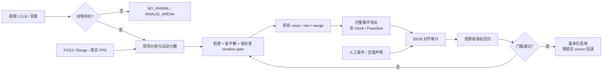

# Depression Suite 新增材料全量验证与产品推进报告

> 验证日期：2026-09-10  
> 报告类型：普通 PE32 逆向的实测验证增量（`flavor = null`）  
> 基线：[FST/TST 逆向分析报告](2026-09-09_逆向工程-DepressionSuite-report.md)  
> 前一版小样本报告：[实测验证报告](2026-09-10_实测验证-DepressionSuite-report.md)  
> 重要更新：本报告的 28 槽全量统计取代前一版 8/20 试次诊断子集的聚合数字；前一版仍作为调查过程和抽帧证据保留。

## 1. 执行摘要

新增目录从 36 个文件增长到 77 个文件；41 个为新增，36 个与旧快照哈希一致，0 个被修改或删除。本地快照的 77/77 个 SHA-256 与只读远端清单一致，远端未被改动。

本轮把 FST 覆盖推进到 28/28 个 CSI 单体工作簿与 28 槽 Bin 汇总完全闭合。35 份可评分人工记录覆盖 27 个非空试次，其中 8 个有双评分者；按试次合并评分者后，CSI 移动时长相对人工的 bias 为 `+0.15 s`、MAE `24.63 s`、RMSE `31.81 s`、Pearson `r=0.842`。误差是明显双向的，不能通过单纯上调或下调 `.09/.11` 阈值解决。

最严重的新发现是一项输入有效性失败：一个人工明确标为空笼的槽位仍被 CSI 输出为 `466.88/467.24 s` Immobile，即 `99.923%`。这比贴壁误差更基础，必须把“动物存在性”检查置于背景差分和行为分类之前，并将失败状态输出为 `NO_ANIMAL/INVALID_ARENA`，绝不能把缺少动物映射为 Immobile。

贴壁仍是稳定的误差放大因素，但不再是单向假阳性的完整解释。`wall_support_still=true` 的 23 条评分 MAE 为 `25.86 s`，非贴壁 12 条为 `14.91 s`；可定位的时间轨迹中诊断 precision 分别为 `0.837` 和 `0.946`。因此贴壁逻辑应先以“贴壁 + 低平移 + 低补偿形变”的联合 shadow gate 接入，而不是硬编码为降级规则。

产品推进顺序应改为：P0 动物存在性/数据质控与事件解析完整性；P0 真实 FPS、几何和输入哈希的可复现记录；P1 联合贴壁门控与 TST 式刚体平移补偿；最后才在视频级盲测上校准阈值。这个方案保留现有分割、DT、scorer、bout 后处理和导出主干，不需要重写软件。

## 2. 授权范围与闭合状态

完整边界见 [scope.md](../scope.md)：授权状态为 `granted`，网络为 `authorized_target_only`。远端只进行了目录遍历、读取、哈希和选择性复制；未修改任何远端文件。Windows 目标 EXE 未被执行，所有程序逻辑结论仍来自静态反编译和产物交叉验证。

| 数据层 | 本轮覆盖 | 状态 |
|---|---:|---|
| 远端增量 | 77 files / 3,319,799 bytes | 41 新、36 不变、0 修改、0 删除；本地 77/77 哈希一致 |
| CSI 单体 FST XLSX | 28 | 28/28 与 Bin 汇总按槽号和所有事件时长一致 |
| 人工 FST 记录 | 36 | 35 份可评分；覆盖 27 个非空试次；1 个声明为空笼 |
| 双评分 | 8 trials | r `0.993`；平均绝对差 `8.89 s`；最大绝对差 `21.60 s` |
| 设置截图 | 7 | General/Motion/Body/Video/Rules/Capture/Sentinel 均已目检 |
| FSS3 SET | 2 路径、同一内容 | SHA-256 相同；1,611/1,611 bytes 完整解析 |
| 新增 CLB | 2 个独立内容、重复副本 | 308-byte、4 arenas × 19 dwords，完整解析 |
| TST | 既有 3 个恢复源 | 3/3 严格视频绑定；仍无 CSI TST 结果导出 |

证据：[E-remote-increment](../evidence/E-remote-increment.md)、[E-remote-full-alignment](../evidence/E-remote-full-alignment.md)、[E-remote-ui-settings](../evidence/E-remote-ui-settings.md)。

## 3. 数据与导出语义核验

### 3.1 28 个工作簿不是“残缺导出”

28/28 个单体工作簿都存在 `Statistics`、`Frames`、`Time`、`Ranges`、`Average` 块；事件明细与 `Ranges` 行逐项相符，`Average=(Frames+Ranges)/2` 也能重算通过。所有工作簿和 Bin 汇总均有 0 个公式单元格、0 个错误单元格，说明它们是字面值导出而非依赖 Excel 公式二次计算。

截图明确显示当前 Score Method 为 `Range Scores (Smoothed) (BEST)`，所以本轮比较以 Range/bout 导出为正式 CSI 口径。全部事件时长都精确落在 `0.04 s` 网格，数据给出的实际采样率为 25 fps。界面上的 `(Actual play speed is 30 frames/second.)` 是静态文本或播放层提示，不能作为后处理换算依据。

### 3.2 事件分类必须完整保真

27 个非空试次的 CSI 事件覆盖为：

| 事件 | 出现试次数 | 合计时长 |
|---|---:|---:|
| Escape | 27 | 8,015.20 s |
| Swim | 27 | 399.36 s |
| Immobile | 27 | 2,030.20 s |
| Climb | 2 | 20.44 s |
| PassDive | 1 | 6.08 s |
| Struggle / Float / Dive | 0 | 0.00 s |

`PassDive` 是真实导出类别，并在一个试次中贡献 6.08 秒。旧版分析脚本曾因只枚举常见类而遗漏它，现已修复。后续解析器必须保留未知/稀有事件，或明确失败；静默丢弃会制造看似很小但实际可积累的 coverage gap。

### 3.3 设置与格式交叉确认

UI 与 FSS3 文件一致：Range Scores；Escape/Immobile；high/low motion `0.11/0.09`；两类事件 merge `20`、min length `15`、noise `10`、bin `5 s`；early merge `5`；high event 使用 Full Body，low event 使用 Either Half，Top/Bottom 都为 Full。完整截图哈希、SET 和 CLB 解析见 [UI/设置核验](../artifacts/remote_increment_ui_settings_review.md)。

逆向已确认 `min/noise/merge` 在后处理器中以帧数使用，因此在本批实际 25 fps 下，`15/10/20` 分别为 `0.60/0.40/0.80 s`。产品实现应从媒体或可信结果元数据读取 FPS，再换算为帧；不能把 25 或 30 写死。

## 4. 全量人工—CSI 对齐

### 4.1 时长级结果

| 切片 | n | CSI−人工 bias | MAE | RMSE | Pearson r |
|---|---:|---:|---:|---:|---:|
| 全部评分 | 35 | `+1.53 s` | `22.11 s` | `29.29 s` | `0.871` |
| 独立试次评分者均值 | 27 | `+0.15 s` | `24.63 s` | `31.81 s` | `0.842` |
| `wall_support_still=true` | 23 | `+4.43 s` | `25.86 s` | `31.96 s` | `0.843` |
| `wall_support_still=false` | 12 | `-4.02 s` | `14.91 s` | `23.35 s` | `0.892` |

完整误差范围为 `-66.66 s` 到 `+62.98 s`。总体 bias 接近零只是正负误差相互抵消，不能解释为个体层面准确。贴壁分层在样本扩充后仍保留更高 MAE，但同时存在较大漏报和多报，所以“统一调高阈值”会修复一侧、恶化另一侧。

双评分者的 8 个试次排序相关很高（`r=0.993`），但平均绝对差仍为 `8.89 s`、最大差 `21.60 s`。这说明总时长层面的高相关不等于边界一致；正式逐事件评估仍需要 non-overlapping canonical onset/offset 和裁决记录。

### 4.2 探索性时间定位

仅 12 条满足“计时戳单调、无回放重叠、累计差 ≤15 秒”的记录进入时间定位：

| 切片 | n | TP | FP | FN | 诊断 precision | 诊断 recall |
|---|---:|---:|---:|---:|---:|---:|
| 全部可用 | 12 | `3415.08 s` | `433.64 s` | `320.07 s` | `0.887` | `0.914` |
| 贴壁 | 7 | `1723.04 s` | `336.44 s` | `239.72 s` | `0.837` | `0.878` |
| 非贴壁 | 5 | `1692.04 s` | `97.20 s` | `80.35 s` | `0.946` | `0.955` |

这些不是正式 framewise 指标：人工数据来自播放器计时操作，存在点击延迟、回放和累计器差异。它们只支持定位误差窗口与验证设计方向。

逐试次数据见 [全量对齐表](../artifacts/remote_increment_comparison_2026-09-10.md)，可机读结果见 [JSON](../artifacts/remote_increment_comparison_2026-09-10.json)。

## 5. 新的 P0：动物存在性门控

声明为空笼的槽位仍输出 `0.36 s` mobile、`466.88 s` Immobile、总计 `467.24 s`。这不是普通的 Immobile 误差，而是“输入无效状态被强制投影到行为类别”的类型错误。若不先处理，任何贴壁、运动补偿或阈值调优都会在缺少动物时继续产生貌似可信的行为统计。

建议把轻量门控放在每槽行为 scorer 之前：

```text
presence_confidence = combine(
    foreground_component_area_persistence,
    valid_mask_overlap,
    centroid_track_continuity,
    animal_shape_or_classifier_support
)

if presence_confidence < threshold for grace_period:
    state = NO_ANIMAL_OR_INVALID_ARENA
    suppress behavior totals
    preserve diagnostics and frames for review
else:
    run existing FST behavior pipeline unchanged
```

关键约束：

- `NO_ANIMAL` 必须是行为分类之外的质控状态，不能等价为 Immobile。
- 要有短暂遮挡/水花的 grace period，避免单帧缺失造成频繁切换。
- 输出 component area、mask overlap、track continuity、presence score 与原因码。
- 将本次空笼槽作为永久回归用例，要求 mobile/immobile 均为 0，状态为 invalid/no-animal。

## 6. 增量产品路线

| 优先级 | 改动 | 默认策略 | 验收 |
|---|---|---|---|
| P0 | 动物存在性/有效槽门控 | 强制质控；行为前置 | 空笼不产生任何行为时长；短遮挡不误杀 |
| P0 | 事件解析完整性 | 保留全部类别；未知类 fail-loud | `PassDive` 等事件不再造成 coverage gap |
| P0 | 输入可复现元数据 | 始终记录 | 视频/转码/CLB/SET/DT 哈希、真实 FPS、宽高、仿射齐全 |
| P1 | 帧数按真实 FPS 换算 | 兼容旧结果、版本化 | 同一视频不同 FPS 转码的秒级 bout 结果稳定 |
| P1 | 贴壁 + 低平移 + 低形变联合门控 | 先 shadow mode | 贴壁分层 FP 降低，非贴壁 recall 不退化 |
| P1 | TST 式刚体平移补偿 | feature flag，旧 scorer 可回退 | 视频级盲集优于当前基线 |
| P2 | `.09/.11` 联动校准 | 仅在盲标集执行 | 按视频组隔离，报告事件/bout/时长及分层指标 |

不要先做单一全局阈值 retune。当前误差双向，且 high-event Full Body、每槽 contrast、water/climb、noise/min/merge 与阈值共同决定输出。建议新增窄接口 `BehaviorEvidence score_frame(...)`，同时返回旧分数、presence、平移、形变、贴壁、pre/postprocess 类别和规则原因；现有导出仍只消费最终类别。

## 7. 验证反馈图



可编辑独立源见 [remote-validation-feedback-loop.mmd](remote-validation-feedback-loop.mmd)。本机没有可用 `mmdc`，因此只交付已人工校验的 Mermaid 源，不声称生成 SVG。

## 8. Evidence 链

| E-id | source_ref | content hash | 关键用途 |
|---|---|---|---|
| E-remote-increment | 授权目录的只读 SHA-256 清单 | `6444135E...5ED63` | 77 文件增量与本地 77/77 校验 |
| E-remote-full-alignment | 本地 XLSX/CSV/JSON 快照 | `34419296...15F41` | 28/28 闭合、35 评分、空笼、事件、分层统计 |
| E-remote-ui-settings | 7 截图 + SET/CLB 解析综述 | `476B26F0...6A49` | Range 口径、参数、25 fps、格式更新 |
| E-static-fst | Ghidra FST 关键函数反编译 | `A4E21E82...C666` | scorer 与 bout 参数按帧使用 |
| E-static-tst | Ghidra TST 关键函数反编译 | 见证据文件 | 刚体平移与中心化形变骨架 |
| E-imports | PE 导入表 | 见证据文件 | 基线二进制身份与能力面；本轮无新增动态行为主张 |

每条 Evidence 的完整 `source_ref`、复现命令、hash 和限制见 [evidence 目录](../evidence/)。

## 9. Findings

### F-012
- title: 新增材料使 FST 结果闭合到 28/28 个 CSI 试次
- severity: info
- category: other
- status: validated
- evidence_ids: [E-remote-increment, E-remote-full-alignment]
- confidence: high
- location: incremental snapshot；28-trial Bin export 与 28 个单体工作簿
- impact: 前一版 8/20 的小样本聚合指标已不再代表当前覆盖；现在有 27 个非空试次人工评分和 8 个双评分试次。
- repro_steps: 核对远端 manifest、本地 77/77 哈希，再运行全量对齐工具。
- remediation: 后续报告以本轮全量数据为基线，保留旧报告作为调查历史。

### F-013
- title: 空笼被输出为 99.923% Immobile，暴露缺失的动物存在性状态
- severity: high
- category: reverse_algo
- status: validated
- evidence_ids: [E-remote-full-alignment]
- confidence: high
- location: declared-empty arena；CSI total 467.24 s
- impact: 无动物输入会生成貌似合理的静止行为统计，可能污染试次、组均值和下游科研结论。
- repro_steps: 在全量对齐 JSON/Markdown 中核对 excluded empty record 与对应 CSI 工作簿，总计为 0.36 s mobile + 466.88 s Immobile。
- remediation: 在行为分类前新增 presence/valid-arena gate；输出 NO_ANIMAL/INVALID_ARENA，禁止映射为 Immobile。

### F-014
- title: 贴壁在全量数据中仍放大误差，但误差为双向
- severity: info
- category: reverse_algo
- status: validated
- evidence_ids: [E-remote-full-alignment, E-static-fst]
- confidence: medium
- location: 35 份可评分记录的 wall_support_still 分层；12 条探索性时间轨迹
- impact: 贴壁评分 MAE 25.86 s，高于非贴壁 14.91 s；探索性 precision 0.837 对 0.946，但总误差范围同时包含显著 FP 和 FN。
- repro_steps: 重跑全量对齐，比较 diagnostic_stats 与 timeline_overlap_diagnostics 分层。
- remediation: 使用贴壁、低平移和低补偿形变的联合 shadow gate；不要硬编码“贴壁即降级”或只调一个全局阈值。
- residual_risk: 时间定位来自播放器计时，不是 canonical frame labels。

### F-015
- title: Range 是当前正式导出口径，28 个工作簿的统计块均完整
- severity: info
- category: file_format
- status: validated
- evidence_ids: [E-remote-full-alignment, E-remote-ui-settings]
- confidence: high
- location: 28 个单体 XLSX；General 设置截图
- impact: 可稳定地用 Range/bout 口径对齐；界面 30 fps 文案与 0.04 s 数据量化冲突，若写死会造成后处理时间错误。
- repro_steps: 检查 28 个工作簿的 Statistics/Frames/Time/Ranges/Average，重算 Range 与 Average，并验证事件时长量化。
- remediation: 记录 `score_method=Range` 和媒体真实 FPS；时间参数以秒配置、运行时换算。

### F-016
- title: Climb 与 PassDive 是实际存在的稀有导出类别
- severity: info
- category: file_format
- status: validated
- evidence_ids: [E-remote-full-alignment]
- confidence: high
- location: 27 个非空 FST 工作簿事件明细
- impact: 只枚举常见 Escape/Swim/Immobile 会静默丢失时长，破坏 trial coverage 闭合。
- repro_steps: 汇总所有事件名称和时长；确认 Climb 为 20.44 s、PassDive 为 6.08 s。
- remediation: 保留未知/稀有类别，或对不认识的事件明确报错并记录原始文本。

### F-017
- title: 双评分总时长高相关仍不足以替代事件边界裁决
- severity: info
- category: other
- status: validated
- evidence_ids: [E-remote-full-alignment]
- confidence: high
- location: 8 个双评分试次
- impact: `r=0.993` 与 MAE 8.89 s、最大差 21.60 s 同时存在；高排序一致性可能掩盖 onset/offset 系统差。
- repro_steps: 按试次配对两名评分者的移动时长，计算相关、绝对差和最大差。
- remediation: 保存原始评分与裁决后的不重叠事件区间；模型选择和最终评估按视频组隔离。

## 10. Path

### P-005
- title: 从远端增量到可回退产品改造的证据路径
- path_type: solve
- start: 授权目录新增的 XLSX/CSV/JSON/SET/CLB/截图
- goal: 在保留现有 FST 主干的前提下，先修复有效性与可复现性，再验证运动门控
- steps:
  1. action: 生成只读增量清单并逐文件校验本地快照 — evidence: E-remote-increment — finding: F-012
  2. action: 使 28 个单体工作簿、Bin 汇总、人工记录和事件 taxonomy 闭合 — evidence: E-remote-full-alignment — findings: F-012, F-016
  3. action: 将声明为空笼的槽提升为分类前质控回归 — evidence: E-remote-full-alignment — finding: F-013
  4. action: 用 UI、FSS3、CLB 与导出量化固定 Range/FPS/参数语义 — evidence: E-remote-ui-settings, E-static-fst — finding: F-015
  5. action: 在原 scorer 后增加贴壁/平移/形变 shadow gate并保留原因 — evidence: E-remote-full-alignment, E-static-fst, E-static-tst — finding: F-014
  6. action: 用 canonical 事件区间和视频级隔离盲测决定是否启用 — evidence: E-remote-full-alignment — finding: F-017
- residual_risks: 仍没有 CSI TST 输出；多数 FST 试次只有一名评分者；未做源视频与转码视频的同模型 A/B；未运行原始 EXE。

## 11. Timeline 摘要

| 时间 | 关键动作 | 结果 |
|---|---|---|
| 2026-09-10 17:38 +08:00 | 在既有授权范围内重开远端增量阶段 | case-guard 通过，保持 remote-read-only |
| 2026-09-10 17:55 +08:00 | 生成远端 SHA-256 清单并与旧快照比较 | 41 新、36 不变、0 修改/删除 |
| 2026-09-10 17:58 +08:00 | 复制小型增量并验证 | 本地 77/77 哈希匹配 |
| 2026-09-10 18:02 +08:00 | 扩展工作簿/事件/评分对齐工具 | 28/28 Bin 与单体导出闭合；PassDive 纳入 |
| 2026-09-10 18:05 +08:00 | 全量误差和空笼质控分析 | 27 非空试次、1 空笼硬失败、8 双评分 |
| 2026-09-10 18:10 +08:00 | UI、FSS3 与 CLB 交叉核验 | Range、25 fps 数据量化、设置和格式闭合 |

完整追加式记录见 [timeline.md](../timeline.md)。

## 12. 复现

```powershell
$python = 'C:\Users\chend\.cache\codex-runtimes\codex-primary-runtime\dependencies\python\python.exe'
$case = 'C:\反向软件\work\Depressionscan_HR_reverse'

& $python "$case\tools\compare_remote_validation.py" `
  "$case\artifacts\remote_increment_snapshot_2026-09-10" `
  --tst-root "$case\artifacts\remote_snapshot\recovered_annotations_v2.2" `
  --json-out "$case\artifacts\remote_increment_comparison_2026-09-10.json" `
  --md-out "$case\artifacts\remote_increment_comparison_2026-09-10.md"

& $python "$case\tools\depressionscan_inspect.py" `
  "$case\artifacts\remote_increment_snapshot_2026-09-10\CSI分析强迫游泳数据\10mg 2周.SET" --compact

Get-FileHash -Algorithm SHA256 -LiteralPath `
  "$case\artifacts\remote_increment_manifest_2026-09-10.json", `
  "$case\artifacts\remote_increment_comparison_2026-09-10.json", `
  "$case\artifacts\remote_increment_ui_settings_review.md"
```

工具：CPython 3.12.14、openpyxl 3.1.5 用于只读 XLSX/CSV/JSON 对齐；Ghidra 12.1.3 与 radare2 6.2.2 用于既有静态逆向。二进制身份、导入表和函数级证据继续沿用基线报告及 [E-imports](../evidence/E-imports.md)。

## 13. 限制与下一门槛

- 35 份评分只覆盖 27 个非空试次；其中只有 8 个有双评分。
- 秒表轨迹不是 canonical frame labels，探索性 overlap 不能当作正式逐帧指标。
- TST 标注虽完成恢复与裁决，但授权目录中没有 CSI TST 输出，无法量化 MotionComp 的产品收益。
- 源/转码几何差异已确认，但尚未做相同模型、相同校准的 A/B 因果测试。
- 未运行原始 EXE；本报告不声称动态行为验证。

下一验收门槛是：先让空笼回归通过；再为 27 个非空试次补齐双人 canonical event intervals；按视频组划分校准/测试；比较“现有基线、presence gate、几何/FPS、贴壁 shadow、平移补偿”消融；最终同时报告事件 onset/offset、bout IoU、移动时长 MAE、贴壁/非贴壁分层和跨转码稳定性。
